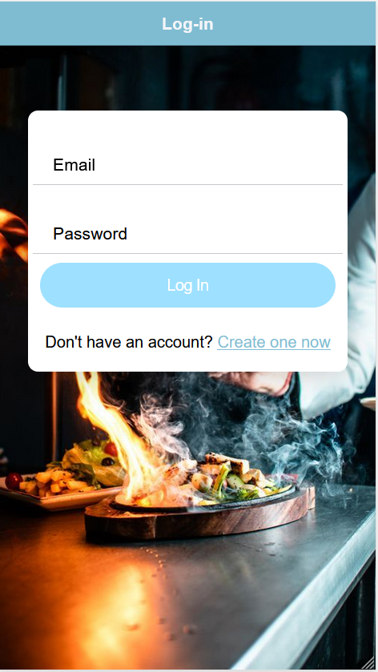

# Cookbook Ionic Application

## Overview

The **Cookbook Ionic Application** is a recipe management application built using the Ionic framework and Angular. It enables users to log in or register, view a collection of recipes, mark their favorite recipes, and contribute by posting their own recipes.

## Features

-  **User Authentication**: Users can register for a new account or log in to access their personalized features.
-  **Recipe Management**: Users can view all available recipes, star their favorite recipes for easy access, and post their own recipes.
-  **PHP Backend**: The application uses a PHP-based API to handle user registration, login, recipe management, and starred recipes.

## Technologies Used

-  **Frontend**: Angular, Ionic Framework, TypeScript, RxJS
-  **Backend**: PHP, MySQL
-  **Authentication**: PHP-based API (with sessions)
-  **Database**: MySQL (for storing users and recipes)

## Workflow

1. **User Registration/Login**:

   -  Users can create an account or log in using their credentials.
   -  Upon successful authentication, users gain access to their profile and additional features.
      

      

2. **Viewing Recipes**:

   -  Users can browse a list of recipes displayed on the home page.
   -  Each recipe includes details such as ingredients, instructions, and options to star (favorite) them.

   

3. **Starring Recipes**:

   -  Users can mark recipes as favorites, which will be saved in their profile for easy access later.

   

4. **Posting Recipes**:

   -  Users can add their own recipes to the app by filling out a form with the recipe details.
   -  New recipes will be stored in the Firebase database and displayed on the home page.

   

## Project Structure of Frontend

The project is organized into several key components and modules, each serving a specific purpose:

-  **app**: Contains the main application module and routing configuration.
-  **auth**: Manages user authentication, including login and registration components.
-  **home**: Displays the home page with a list of recipes and user interactions.
-  **cooking-history**: Page that displays a brief history of cooking.

### Key Components and Modules

1. **AppModule (`app.module.ts`)**: The root module that bootstraps the application and configures global providers, including the routing setup and HTTP client.

2. **AppRoutingModule (`app-routing.module.ts`)**: Defines the application routes and sets up lazy loading for feature modules. Uses guards to protect routes that require user authentication.

3. **AuthGuard (`auth.guard.ts`)**: A route guard that prevents access to certain routes for unauthenticated users.

4. **AuthService (`auth.service.ts`)**: Handles authentication logic, including login, registration, and logout functionality, utilizing Firebase for user management.

### How Angular Works

Angular is a platform and framework for building client-side applications using HTML and TypeScript. The key concepts include:

-  **Components**: Angular applications are built using components, which are self-contained units of code that control a view (a part of the user interface). Each component consists of:

   -  A TypeScript class that defines the behavior.
   -  An HTML template that defines the view.
   -  A CSS stylesheet for styling.

-  **Modules**: Angular applications are modular, allowing you to organize components into cohesive blocks of functionality. Each Angular app has at least one root module (`AppModule`).

-  **Services**: Services are used to encapsulate business logic and data operations. They are typically used for tasks like data fetching, authentication, or shared functionality across components.

-  **Routing**: Angular's router enables navigation between different views or components. Routes are defined in the `AppRoutingModule`, and components are loaded lazily for performance optimization.

## Backend in PHP Integration

### Technologies Used

-  PHP for backend logic.
-  MySQL for data storage.
-  XAMPP (Apache, MySQL) for local development environment

### File Structure

```
/backend_mobilno_racunarstvo
│
├── /config
│   ├── database.php            # Database connection setup
│
├── /header
│   ├── cors.php               # CORS configuration (for API access)
│
├── /middleware
│   ├── auth.php               # Authentication middleware
│   ├── sessionInit.php        # Session initialization for the app
│
├── /models
│   ├── Recipe.php             # Model for the 'recipes' table
│   ├── StarredRecipe.php      # Model for the 'starred_recipes' table
│   ├── User.php               # Model for the 'users' table
│
├── /routes
    ├── auth.php               # Routes for user authentication
    ├── recipes.php            # Routes for recipe management
    ├── starredRecipes.php     # Routes for starred recipes
    ├── output.log             # Log file for debugging

```

### Set Up the Database

1. Start Apache and MySQL using the XAMPP control panel.
2. In order for backedn to run with the XAMPP, you must place backend project inside XAMPP's htdocs folder.
3. Create the Database: Open phpMyAdmin (http://localhost/phpmyadmin/) and create a database.
4. Run the SQL Schema: Import the provided schema.sql file to create the necessary tables, or use the following schema to create the required tables:

```
CREATE TABLE users (
    id INT AUTO_INCREMENT PRIMARY KEY,
    username VARCHAR(255) NOT NULL,
    email VARCHAR(255) NOT NULL,
    password VARCHAR(255) NOT NULL
);

CREATE TABLE recipes (
    id INT AUTO_INCREMENT PRIMARY KEY,
    user_id INT NOT NULL,
    recipe_name VARCHAR(255) NOT NULL,
    num_of_ingredients INT NOT NULL,
    num_of_servings INT NOT NULL,
    num_of_cal INT NOT NULL,
    details TEXT,
    image_url VARCHAR(255),
    FOREIGN KEY (user_id) REFERENCES users(id) ON DELETE CASCADE
);

CREATE TABLE starred_recipes (
    user_id INT NOT NULL,
    recipe_id INT NOT NULL,
    PRIMARY KEY (user_id, recipe_id),
    FOREIGN KEY (user_id) REFERENCES users(id) ON DELETE CASCADE,
    FOREIGN KEY (recipe_id) REFERENCES recipes(id) ON DELETE CASCADE
);

```

### Configure Database Connection

Open `/config/database.php` and set up the MySQL credentials (host, username, password, database name) to match your local setup.

### Example API Endpoints

-  `http://localhost/backend/routes/auth.php` - Auth
-  `http://localhost/backend/routes/recipes.php` - Recipes
-  `http://localhost/backend/routes/starredRecipes.php` - Starred Recipes

## Installation Instructions

### Prerequisites

-  **Node.js**: Ensure you have Node.js installed (v14 or higher). If you don't have it installed, download it from [Node.js Official Website](https://nodejs.org/).

-  Check your version with:

   ```
   node -v
   ```

-  Angular CLI (installed globally)
   Ionic CLI: Install the Ionic CLI globally using npm:
   `  npm install -g @ionic/cli`

### Setting Up the Project

```
git clone https://github.com/Filipovic13/Mobilno-racunarstvo-projekat
```

### Start the Ionic development server:

```
ionic serve
```

Open in Browser: Access your application in the web browser `at http://localhost:8100`.
